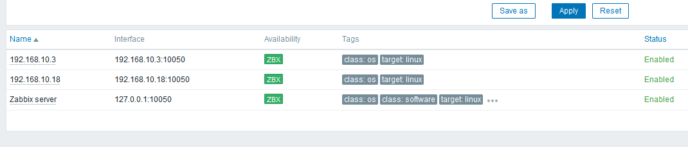

### Модуль 7: Автоматизация и CI/CD

Чтобы проект был более читаем, он был разделен на директории, в которых по отдельности хранятся манифесты для Terraform и менеджмент конфигурации на Ansible. Дополнительно была создана общая директория с SSH ключом и его публичной частью, чтобы было удобно передавать эти данные обоим инструментам.

Для решения данной задачи сначала был написан Terraform манифет, который развертывает 5 виртуальные машины на базе ОС Ubuntu в облачном провайдере Yandex.Cloud. После выполнения манифеста создается файл инвентаря для Ansible, в котором перечисленны необходимые переменные, которые позволят уменьшить количество запросов этой информации через Ansible.

После этого использовался написанный мной ранее шаблон для Ansible, который я обычно применяю для начала проекта. В нем я описал установку репозитория Zabbix для систем на базе Ubuntu и CentOS 7 а после установку пакетов для каждой машины. Плейбук разделен на разные plays, чтобы последовательно настраивать лишь необходимые нам машины.

В конечном итоге приминение данного кода можно выполнить следующим набором команд, предварительно задав в `terraform.tfvars` переменные, которые требует провайдер Yandex.Cloud, чтобы нас идентифицировать и создавать ресурсы в нужной папке облака.

```
cd keys
ssh-keygen -f id_rsa
cd ..

cd zabbix/terraform
terraform init
terraform apply

cd ../ansible
ansible-playbook -i inventory.ini provision.yml
```
В конце вывода работы плейбука будет размещена ссылка, по которой можно подключиться к веб дашборду Zabbix используя стандартные для этого логин и пароль - `Admin/zabbix` 

Добавление клиентских машин в систему мониторинга производится вручную.




