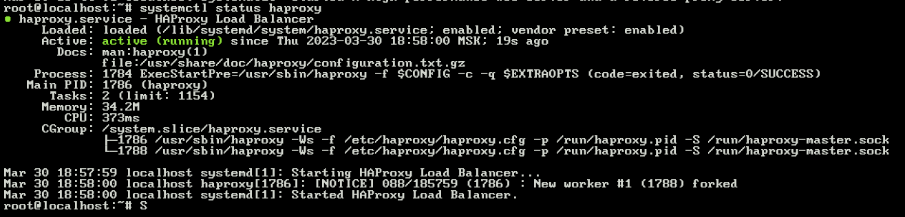
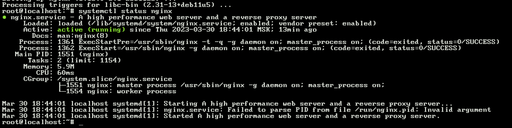

# Домашнее задание к занятию 10.5 «Балансировка нагрузки. HAProxy/Nginx»

---

### Задание 1

Что такое балансировка нагрузки и зачем она нужна? 

Балансировка нагрузки это метод распределения сетевой нагрузки между набором серверов для более эффективного и отказоустойчивого распределения ресурсов. 

Балансировка нагрузки нужна для того, чтобы можно было масштабировать ресурсы, увеличивать производительность и безопасность приложений.

---

### Задание 2

Чем отличаются алгоритмы балансировки Round Robin и Weighted Round Robin? В каких случаях каждый из них лучше применять? 

Round Robin это алгоритм распределения запросов между серверами циклично, отправляя один запрос одному серверу, другой уже следующему.

Weighted Round Robin действует примерно так же, только у серверов появляется "вес", который определяет, сколько запросов ему можно послать в ряд. 

Например есть server1 с весом 3 и server2 с весом 1, первые три запроса отправятся на server 1, а четвертый на server 2, пятый снова на server1.

---

### Задание 3

Установите и запустите Haproxy.

*Приведите скриншот systemctl status haproxy, где будет видно, что Haproxy запущен.*



---

### Задание 4

Установите и запустите Nginx.

*Приведите скриншот systemctl status nginx, где будет видно, что Nginx запущен.*



---

### Задание 5

Настройте Nginx на виртуальной машине таким образом, чтобы при запросе:

`curl http://localhost:8088/ping`

он возвращал в ответе строчку: 

"nginx is configured correctly".

*Приведите конфигурации настроенного Nginx сервиса и скриншот результата выполнения команды curl http://localhost:8088/ping.*

``` 
server {
        listen 8088 default_server;

        location /ping {
                return 200 "nginx is configured correctly\n";
        }
} 
```


---

## Задания со звёздочкой*

Эти задания дополнительные. Их выполнять не обязательно. На зачёт это не повлияет. Вы можете их выполнить, если хотите глубже разобраться в материале.

---

### Задание 6*

Настройте Haproxy таким образом, чтобы при ответе на запрос:

`curl http://localhost:8080/`

он проксировал его в Nginx на порту 8088, который был настроен в задании 5 и возвращал от него ответ: 

"nginx is configured correctly". 

*Приведите конфигурации настроенного Haproxy и скриншоты результата выполнения команды curl http://localhost:8080/.*

``` 
frontend localhost
        bind *:8080
        mode http
        default_backend web_servers
        http-request set-path /ping

backend web_servers
    server server1 127.0.0.1:8088
``` 

